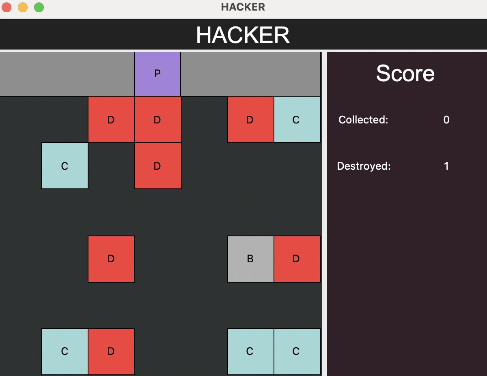

# Hacker Game (Python)

Hacker is a grid-based arcade-style shooting and collection game built with Python and Tkinter, inspired by classic Space Invader. The game challenges players to shoot or collect falling objects while tracking scores and avoiding failure conditions.

## 🕹️ Features

- **Turn-based grid system**: Player remains fixed while entities fall from the top.
- **Entity interactions**:
  - Collectables can be collected or destroyed
  - Destroyables must be destroyed before reaching the player area
  - Bombs deal splash damage
- **Score system**: Track collected items, destroyed targets, and total shots.
- **GUI**: Built with `tkinter` Canvas and image rendering via `Pillow (PIL)`
- **Game persistence**: Supports saving and loading game state via local file system
- **Timers & Events**: Includes game timer, pause/play toggle, and keybindings for game control

## 🧠 Tech Stack

- Python 3
- Tkinter (GUI)
- PIL / Pillow (image processing)
- Object-Oriented Programming
- MVC design pattern

## 📸 Screenshots

  
_(Insert a screenshot of gameplay here)_

## 🚀 Getting Started

### Prerequisites

- Python 3.x
- `Pillow` module: install with `pip3 install Pillow`

### Run the Game

```bash
python3 a3.py
```

### Controls

- `← / →` : Rotate the grid
- `C` : Collect shot
- `D` : Destroy shot
- `Pause / Play` : Control the timer
- Menu: New Game, Save Game, Load Game, Quit

## 💾 Save/Load Game

You can save and resume your progress. Game state includes:

- Timer
- Collected and destroyed entities
- Total shots
- All entities' positions on grid

## 📁 File Structure

```
.
├── a3.py                # Main game logic and UI
├── a3_support.py        # Constants and helper classes (not included here)
├── images/              # Sprite images for each entity
├── save_game.txt        # Save file (generated during game)
└── README.md
```

## 🧑‍💻 Author

Lyle Yang
